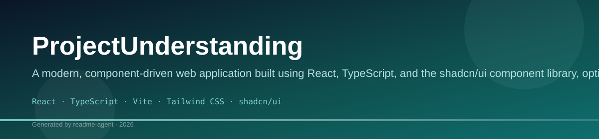
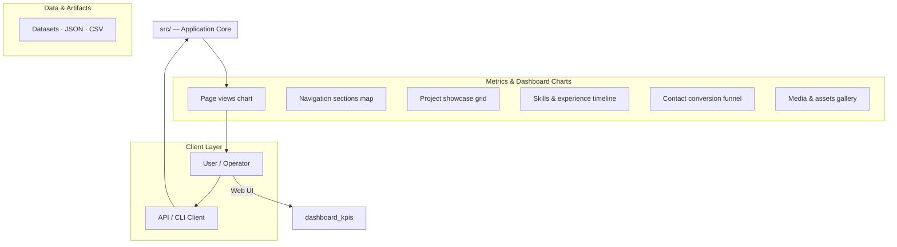
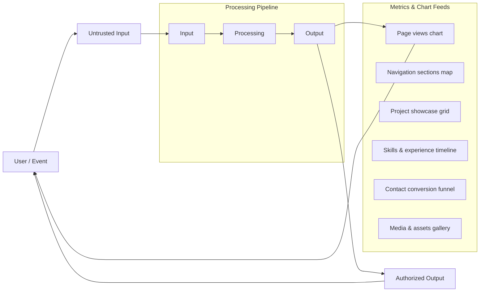
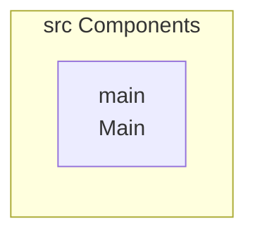
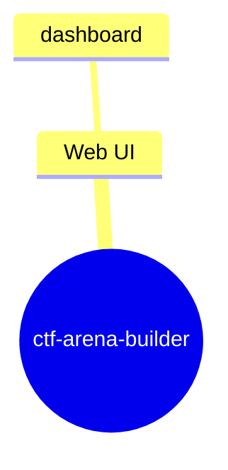
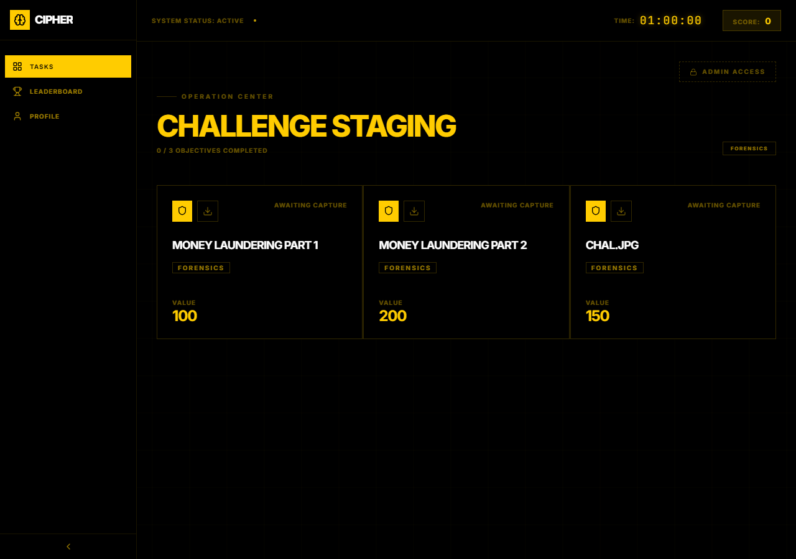
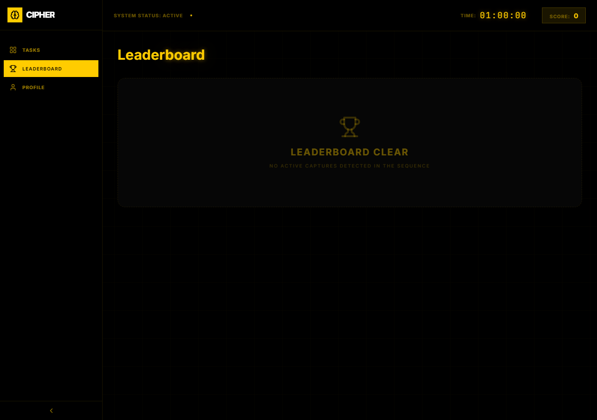
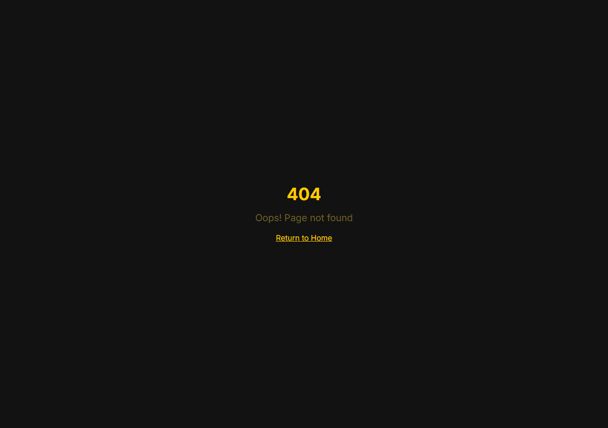

# ProjectUnderstanding

A modern, component-driven web application built using React, TypeScript, and the shadcn/ui component library, optimized with Vite and Tailwind CSS.

## Overview

This repository contains a fully structured, component-based web application designed for modern development workflows. It leverages the power of React and TypeScript for type safety, combined with the utility and aesthetic benefits of shadcn/ui and Tailwind CSS. The project is configured with Vite for fast development and includes comprehensive scripts for development, building, testing, and linting.

## Key Features

- Component-driven architecture using shadcn/ui components.
- Type safety enforced through TypeScript.
- Optimized build performance via Vite.
- Comprehensive development tooling including linting and testing scripts.
- Support for state management and data fetching (implied by dependencies like react-query).

## Technology Stack

- React
- TypeScript
- Vite
- Tailwind CSS
- shadcn/ui
- JavaScript
- ESLint
- Vitest

## ProjectUnderstanding

A modern, component-driven web application built using React, TypeScript, and the shadcn/ui component library, optimized with Vite and Tailwind CSS.

This repository contains a fully structured, component-based web application designed for modern development workflows. It leverages the power of React and TypeScript for type safety, combined with the utility and aesthetic benefits of shadcn/ui and Tailwind CSS. The project is configured with Vite for fast development and includes comprehensive scripts for development, building, testing, and linting.

## ✨ Features

*   **Component-driven architecture:** Utilizes shadcn/ui components for a consistent and reusable UI.
*   **Type Safety:** Enforces robust type safety throughout the codebase using TypeScript.
*   **Optimized Performance:** Benefits from Vite's fast development server and optimized build process.
*   **Comprehensive Tooling:** Includes dedicated scripts for linting (ESLint) and testing (Vitest) to maintain high code quality.
*   **Scalability:** Designed with a standard modern React component architecture, making it highly maintainable and scalable.

## 🏗️ Architecture

The application follows a standard modern React component architecture. Components are built using TypeScript and styled with Tailwind CSS, utilizing the shadcn/ui pattern for reusable, accessible UI elements. The structure is designed to be scalable and maintainable, separating components, pages, and utility logic.

## 🚀 Getting Started

Follow these steps to get the project running locally.

1.  **Clone the repository:**
    ```bash
git clone <repository-url>
```
2.  **Navigate into the directory:**
    ```bash
cd <repository-name>
```
3.  **Install dependencies:**
    ```bash
npm install
# or yarn install / pnpm install
```

## 💻 Development Workflow

### Running the Application

To run the application locally in development mode, execute:
```bash
npm run dev
```

The application will typically be accessible at `http://localhost:5173` (or a similar port).

### Building for Production

To generate the optimized static assets for deployment:
```bash
npm run build
```

### Testing and Linting

The project includes dedicated scripts to ensure code quality:

*   **Unit/Component Testing:** Run unit tests using Vitest and React Testing Library:
    ```bash
npm run test
    ```
*   **Linting:** Enforce code standards and catch potential errors using ESLint:
    ```bash
npm run lint
    ```

## 🛠️ Tech Stack

This project utilizes a robust modern JavaScript ecosystem:

*   **Framework:** React
*   **Language:** TypeScript
*   **Build Tool:** Vite
*   **Styling:** Tailwind CSS
*   **Components:** shadcn/ui
*   **Tooling:** ESLint, Vitest

## 📂 Project Structure

The project utilizes a standard Vite/React structure. Key directories include:

*   `src/`: Contains the core source code, separating components, pages, and utility logic.
*   `vite.config.ts`, `tailwind.config.js`: Configuration files for the build tool and styling.
*   `package.json`: Dependency and script management.

## ⚠️ Limitations

*   The README does not provide specific instructions for connecting a custom domain, only general guidance on the process.

## 🔮 Future Improvements

*   Adding detailed API documentation for custom hooks or components.
*   Implementing more robust CI/CD pipelines beyond basic build scripts.

## Setup Guide

### Frontend Setup

```bash

npm install
npm run dev     # development
npm run build && npm start   # production
```

Open `http://127.0.0.1:5173` (or the port shown in the terminal).

### Running the Application

1. **Start web app** — `npm run dev` in `./`

```bash
cd .
npm install
npm run dev
```

## System Architecture

High-level system design, data flows, API map, and workflow pipelines derived from the repository structure.

### System Architecture



### Data Flow & Charts Pipeline



### Component & API Map



### Application Page Map



## Application Pages

Screenshots captured from the running application. Each page is listed with its function.

### Application

#### Dashboard

Dashboard — application page at `/dashboard`



#### Leaderboard

Leaderboard — application page at `/leaderboard`



#### Profile

Profile — application page at `/profile`


